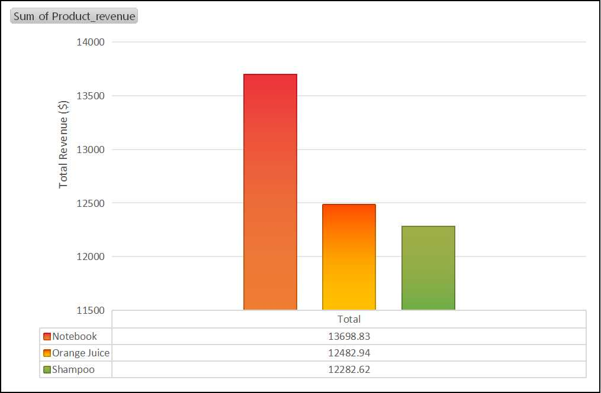

# 🛒 Retail Sales Analytics Dashboard

## 📌 Project Overview
This project analyzes retail transaction data to identify sales trends across different product lines, cities, and customer segments. Using **SQL** for data extraction and **Excel** for visualization, this dashboard provides actionable insights into revenue drivers.

## 📊 Dashboard Highlights

### 1. Product Performance

*   **Top Performer:** "Notebooks" generate the highest total revenue (~$13,700) and also have the highest average transaction value.
*   **Opportunity:** "Shampoo" and "Orange Juice" have lower revenue figures, suggesting a need for bundling strategies or marketing adjustments.

### 2. Regional Analysis

*   **Competitive Landscape:** Revenue is tightly distributed across major cities. **Los Angeles** leads slightly ($19,894), followed closely by New York and Chicago. This indicates a consistent market demand across all three regions.

### 3. Customer Segmentation

*   **Membership Split:** The customer base is fairly balanced, with **Member (54%)** slightly outpacing Normal (46%) customers. This suggests a successful loyalty program adoption.

---

## 🔎 Technical Approach
### Tools Used
*   **SQL:** Used to clean the raw data, handle null values, and aggregate sales by category and location.
*   **Excel:** Used for Pivot Tables and generating the final visualization charts.

### Key Metrics Analyzed
*   **Total Revenue** by Product Line & City.
*   **Average Transaction Value** (ATV) per product category.
*   **Customer Distribution** (Member vs. Non-Member).

## 📂 Project Structure
*   `retail_sales_analysis.sql`: Contains the SQL queries used for data aggregation.
*   `sales_data.xlsx`: The raw dataset and pivot tables.
*   `images/`: Folder containing dashboard visualizations.
